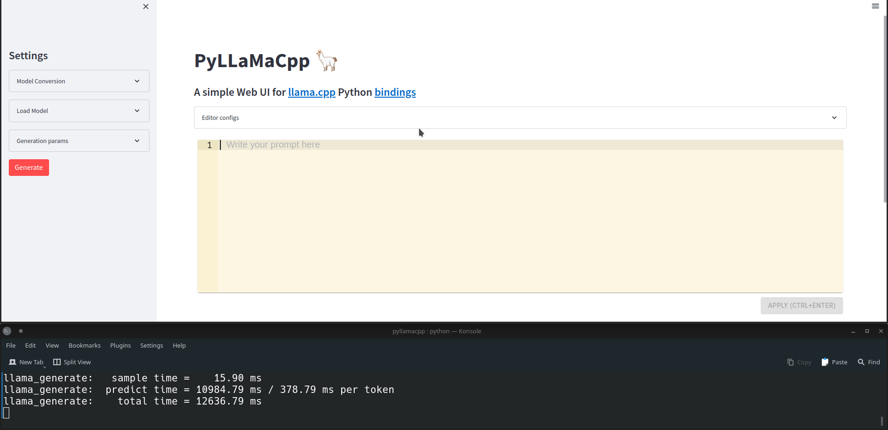

# PyLLaMaCpp
Python bindings for [llama.cpp](https://github.com/ggerganov/whisper.cpp) + A simple web UI

[//]: # ([![License: MIT]&#40;https://img.shields.io/badge/license-MIT-blue.svg&#41;]&#40;https://opensource.org/licenses/MIT&#41;)

[//]: # ([![Wheels]&#40;https://github.com/abdeladim-s/pyllamacpp/actions/workflows/wheels.yml/badge.svg?branch=main&event=push&#41;]&#40;https://github.com/abdeladim-s/pyllamacpp/actions/workflows/wheels.yml&#41;)

[//]: # ([![PyPi version]&#40;https://badgen.net/pypi/v/pyllamacpp&#41;]&#40;https://pypi.org/project/pyllamacpp/&#41;)

<br/>
<p align="center">
  
</p>


For those who don't know, llama.cpp is a port of Facebook's LLaMA model in pure C/C++.

The main features are:

<blockquote>

- Plain C/C++ implementation without dependencies
- Apple silicon first-class citizen - optimized via ARM NEON
- AVX2 support for x86 architectures
- Mixed F16 / F32 precision
- 4-bit quantization support
- Runs on the CPU

</blockquote>

# Table of contents
<!-- TOC -->
* [Installation](#installation)
* [Usage](#usage)
    * [Web UI](#web-ui)
    * [Python bindings](#python-bindings)
* [Discussions and contributions](#discussions-and-contributions)
* [License](#license)
<!-- TOC -->

# Installation
1. The easy way is to use the prebuilt wheels
```bash
pip install pyllamacpp
```

However, the compilation process of `llama.cpp` is taking into account the architecture of the target `CPU`, 
so you might need to build it from source:

```shell
git clone --recursive https://github.com/abdeladim-s/pyllamacpp && cd pyllamacpp
pip install .
```

# Usage

### Web UI
The package contains a simple web UI to test the bindings:

- Lightweight, and easy to use.
- Only needs Python.
- Has the option to convert the models to `ggml` format.
- A code like editor.
- Different options to tweak the llama.cpp parameters.
- Ability to export the generated text.

From the command line, run:
```shell
pyllamacpp-webui
```

That's it!<br>
A web page will be opened on your default browser, otherwise navigate to the links provided by the command.


### Python bindings

You can call the package directly from Python, if you want to create your own scripts or APIs:

```python
from pyllamacpp.model import Model

def new_text_callback(text: str):
    print(text, end="")

model = Model(ggml_model='./models/ggml-model-f16-q4_0.bin', n_ctx=512)
model.generate("hello, my name is ", n_predict=55, new_text_callback=new_text_callback)
```
If you don't want to use the `callback`, you can get the results from the `generate` method once the inference is finished:

```python
generated_text = model.generate("hello, my name is ", n_predict=55)
print(generated_text)
```
You can always refer to the [short documentation]() for more details.

# Discussions and contributions
If you find any bug, please open an [issue](https://github.com/abdeladim-s/pyllamacpp/issues).

If you have any feedback, or you want to share how you are using this project, feel free to use the [Discussions](https://github.com/abdeladim-s/pyllamacpp/discussions) and open a new topic.

# License

This project is licensed under the same license as [llama.cpp](https://github.com/ggerganov/whisper.cpp/blob/master/LICENSE) (MIT  [License](./LICENSE)).

